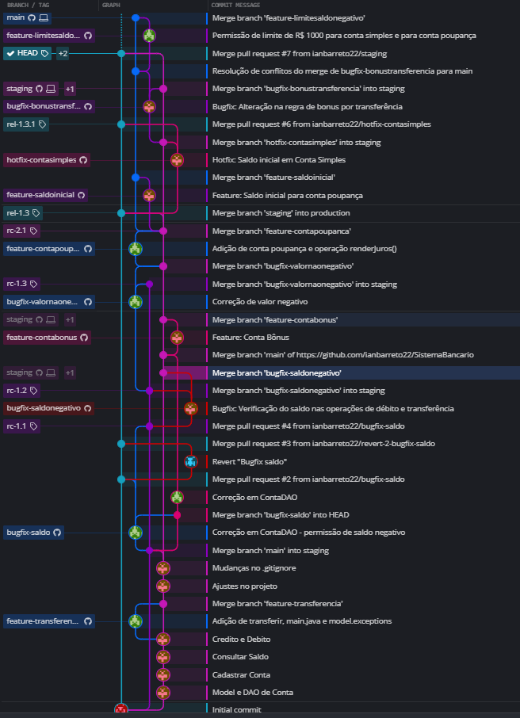

# SistemaBancario

Projeto para a disciplina Gerência de Configuração e Mudanças

## Organização e Histórico do Repositório

Para a realização desse trabalho decidimos adotar o fluxo GitLab Flow, que possui 3 branches principais.

A main, que é a branch de referência para desenvolvimento. Essa é a branch que deve conter a versão atualizada do sistema em construção.
A branch staging é a referência para homologação do produto, contém a versão que está sendo estabilizada que em breve será liberada para produção.
Já a branch production contém a versão do código que está em produção e está liberada para a utilização dos usuários.

Como branch auxiliares utilizamos a feature, que contém novas funcionalidades que estavam sendo implementadas, e que seriam integrada a branch main.
Utilizamos bugfix criada a partir da staging, para realizar correções na versão que estava sendo estabilizada. As branchs bugfix deveriam ser juntadas a branch main e staging.
Já a hotfix foi utilizada para a correções de bugs encontrados na versão em produção. A brach era criada a partir da production e feito o merge para a production e staging.

